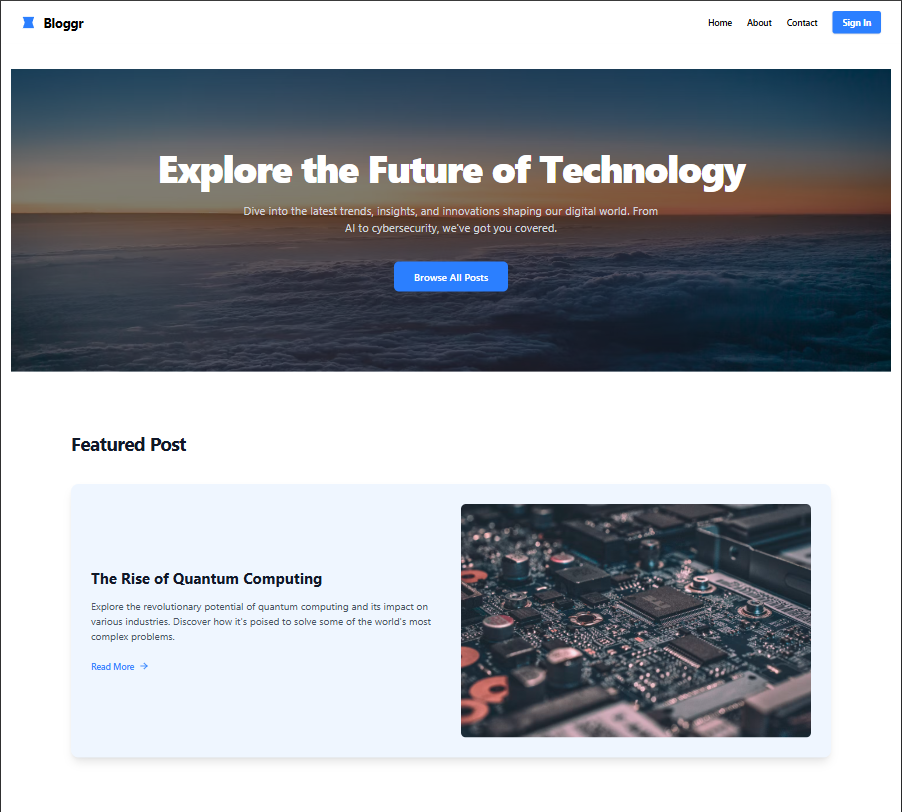

<div align="center" id="top"> 
  

&#xa0;

<a href="https://blog-app-azure-nu.vercel.app">Delpoyed working URL</a>

</div>

<h1 align="center">Bloggr App</h1>

<p align="center">
  

  

  

  

  

  

  
</p>

<!-- Status -->

<!-- <h4 align="center">
	🚧  Blog App 🚀 Under construction...  🚧
</h4>

<hr> -->

<p align="center">
  <a href="#🎯-about">About</a> &#xa0; | &#xa0; 
  <a href="#✨-features">Features</a> &#xa0; | &#xa0;
  <a href="#🚀-technologies">Technologies</a> &#xa0; | &#xa0;
  <a href="#✅-requirements">Requirements</a> &#xa0; | &#xa0;
  <a href="#🚩-starting">Starting</a> &#xa0; | &#xa0;
  <a href="#📝-license">License</a> &#xa0; | &#xa0;
  <a href="https://github.com/Mohammad-Hassan027" target="_blank">Author</a>
</p>

<br>

## 🎯 About

This is a full-stack blog application that allows users to create, read, update, and delete blog posts. It features user authentication, a rich text editor for creating and editing posts, and a commenting system. The application is built with a React frontend and a Node.js/Express backend, with MongoDB for the database.

This project serves as a comprehensive example of a modern web application, integrating various technologies to provide a seamless user experience. The frontend is a single-page application (SPA) built with React and Vite, ensuring a fast and responsive user interface. State management is handled efficiently by Zustand, a small, fast, and scalable state-management solution.

The backend is a robust RESTful API built with Node.js and Express, responsible for handling all business logic and data manipulation. It connects to a MongoDB database using Mongoose for object data modeling. User authentication is securely managed by Firebase Authentication, providing both email/password and social login options. Image uploads are handled by Cloudinary, a cloud-based image and video management service.

The application is designed to be easily deployable,

## ✨ Features

### 🔐 User Authentication:

Users can sign up, log in, and log out. Authentication is handled using Firebase.

### ☑️ Responsive Design:

A seamless and attractive user experience on any device, from desktops to mobile phones, thanks to Tailwind CSS.

### ☑️ Create, Read, Update, and Delete (CRUD) Posts:

Authenticated users can create, edit, and delete their own blog posts.

### ☑️ Rich Text Editor:

Posts can be written in Markdown for easy formatting.

### ☑️ Commenting System:

Users can comment on blog posts.

### ☑️ Dashboard:

A user dashboard to manage all of their posts.

### ☑️ Image Uploads:

Users can upload images for their blog posts to Cloudinary.

### ☑️ Drafts and Published Posts:

Users can save posts as drafts or publish them.

### ☑️ Profile Management:

Users can update their display name and profile picture.

### ☑️ State Management:

The application uses Zustand for efficient state management.

## Features To-Do

- [ ] **Social Sharing:** Add buttons to share posts on social media platforms like Twitter, Facebook, and LinkedIn.

- [ ] **Likes/Reactions:** Implement a system for users to like or react to posts.

- [ ] **Advanced Search:** Enhance the search functionality to filter posts by content, author, and tags.

- [ ] **Categories/Tags Filtering:** Allow users to filter and browse posts by categories and tags.

- [ ] **Public User Profiles:** Create public profiles for users to showcase their posts and activity.

- [ ] **Email Notifications:** Implement a system to notify users about new comments on their posts.

- [ ] **Pagination:** Add pagination for blog post lists and comments for better performance and user experience.

- [ ] **Admin Panel:** Develop an admin panel for managing users, posts, and comments.

- [ ] **Password Reset:** Add a password reset feature for users who sign up with an email and password.

- [ ] **WYSIWYG Editor:** Replace the raw Markdown editor with a more user-friendly WYSIWYG editor.

- [ ] **Follow System:** Allow users to follow their favorite authors and receive notifications about their new posts.

## 🚀 Technologies

The following tools were used in this project:

- [Express](https://expressjs.com/)
- [Node.js](https://nodejs.org/en/)
- [React](https://pt-br.reactjs.org/)
- [Firebase](https://firebase.google.com/docs/)
- [Tailwind](https://tailwindcss.com/)
- [Mongo DB](https://www.mongodb.com/)
- [Cloudinary](https://cloudinary.com/)
- [Zustand](https://zustand-demo.pmnd.rs/)

## ✅ Requirements

Before starting 🚩, you need to have [Git](https://git-scm.com) and [Node](https://nodejs.org/en/) installed.

## ✅ Environment Configuration

Copy the environment template and configure your settings:

### For server

```bash
cp .env.example .env
```

Edit the `.env` file with your configuration:

```env
# Rename to .env and fill values
MONGO_URI=xyz
PORT=5000

# Firebase admin SDK service account JSON - either path to file or paste JSON string
FIREBASE_SERVICE_ACCOUNT_PATH=xyz

# Cloudinary
CLOUDINARY_CLOUD_NAME=xyz
CLOUDINARY_API_KEY=123
CLOUDINARY_API_SECRET=xyz
CLOUDINARY_URL=xyz

# Optional: frontend origin for CORS
FRONTEND_ORIGIN=http://localhost:5173

```

### For client

```bash
cp .env.example .env
```

Edit the `.env` file with your configuration:

```env
# Firebase Auth
VITE_FIREBASE_API_KEY=xyz
VITE_FIREBASE_AUTH_DOMAIN=xyz
VITE_FIREBASE_PROJECT_ID=xyz
VITE_FIREBASE_STORAGE_BUCKET=xyz
VITE_FIREBASE_MESSAGING_SENDER_ID=123
VITE_FIREBASE_APP_ID=123
VITE_FIREBASE_MEASUREMENT_ID=123

# Backend API
VITE_API_URL=http://localhost:5000
```

## 🚩 Starting

```bash
# Clone this project
$ git clone https://github.com/Mohammad-Hassan027/blog-app

# Access
$ cd blog-app

# Access
$ cd server

# Install dependencies
$ npm install

# Run the project
$ npm run dev

# The server will initialize in the <http://localhost:5000> 🚀

# Access
$ cd client

# Install dependencies
$ npm install

# Run the project
$ npm run dev

# The server will initialize in the <http://localhost:5173> 🚀
```

## 📝 License

This project is under license from MIT. For more details, see the [LICENSE](LICENSE.md) file.

Made with 💖 by <a href="https://github.com/Mohammad-Hassan027" target="_blank">Mohammad Hassan</a>

&#xa0;

<a href="#top">Back to top</a>
